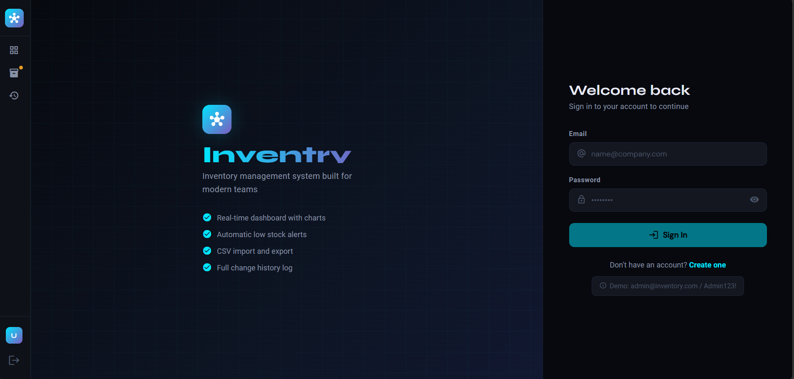
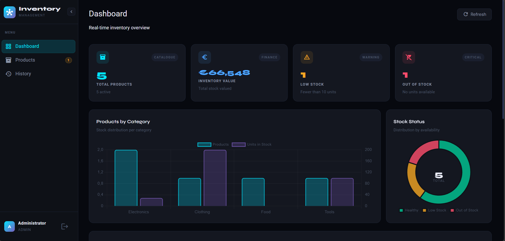
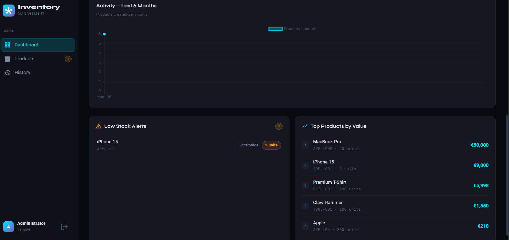
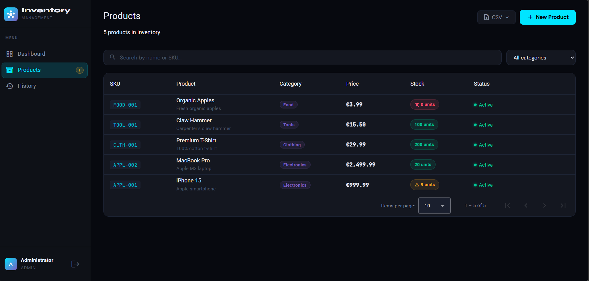
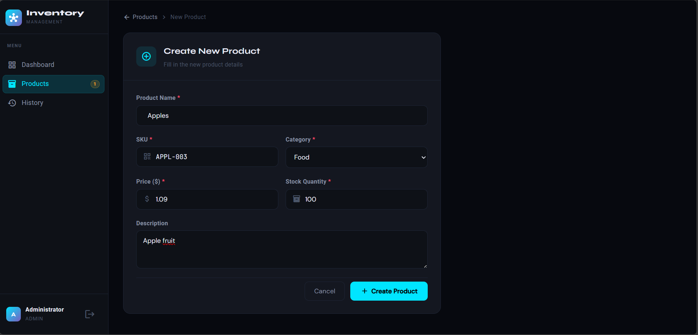
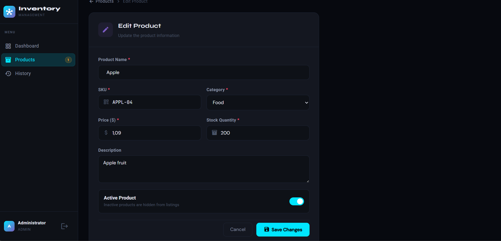
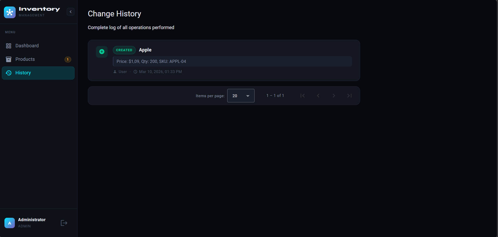
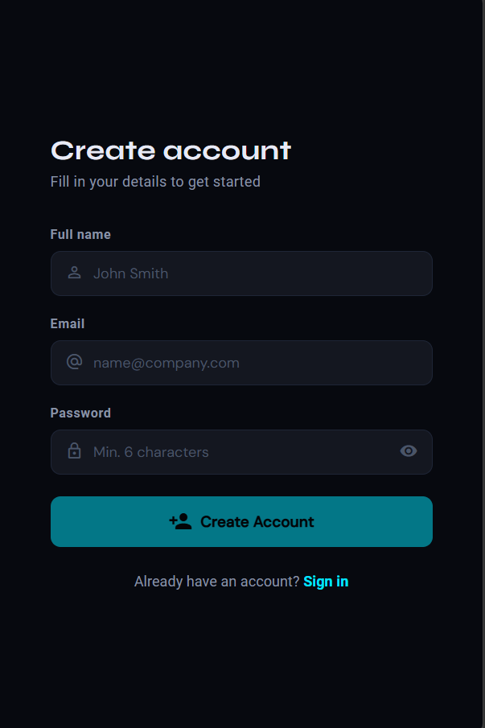

# Inventory — Inventory Management System

A full-stack portfolio project built with **.NET 8 Web API** and **Angular 17**.

## Tech Stack

### Backend
- .NET 8 Web API
- Entity Framework Core + SQLite
- JWT Authentication (BCrypt)
- Swagger / OpenAPI
- xUnit + Moq + FluentAssertions

### Frontend
- Angular 17 (standalone components)
- Angular Material (dark theme)
- Chart.js (dashboard charts)
- RxJS, HTTP Interceptors, Route Guards

## Features

- JWT authentication (register/login)
- Product CRUD with pagination, search and category filter
- Dashboard with real-time charts (Chart.js)
- Low stock alerts
- Full change history (audit log)
- CSV import and export
- Role-based access (Admin / User)

## Getting Started

### Backend
```bash
cd backend/InventoryAPI
dotnet run
# API available at http://localhost:5000
# Swagger UI at http://localhost:5000/swagger
```

### Frontend
```bash
cd frontend
npm install
ng serve
# App available at http://localhost:4200
```

## Demo Credentials
- **Email:** admin@inventory.com
- **Password:** Admin123!

## Run Tests
```bash
cd backend/InventoryAPI.Tests
dotnet test
```

## Screenshots 
- **Main Page:** Login and registration forms.



- **Dashboard:** Real-time charts showing inventory stats.




- **Product Management:** Product list with pagination, search, and category filter, along with create/edit product forms.



- **Create and Edit Product:** Forms for adding and updating product details.




- **History:** Page showing all changes made to products with timestamps and user info.



- **Create User:** Page to create new users




